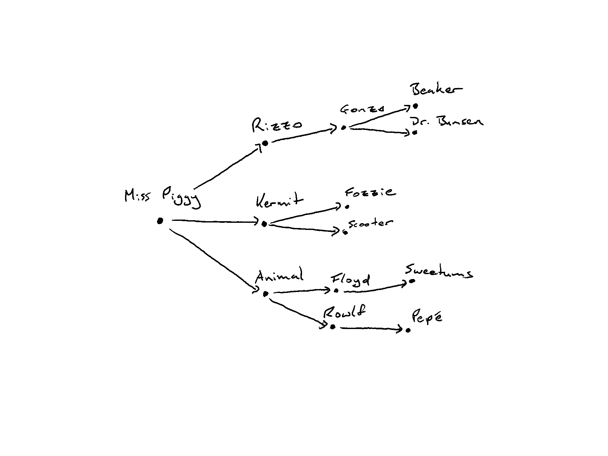
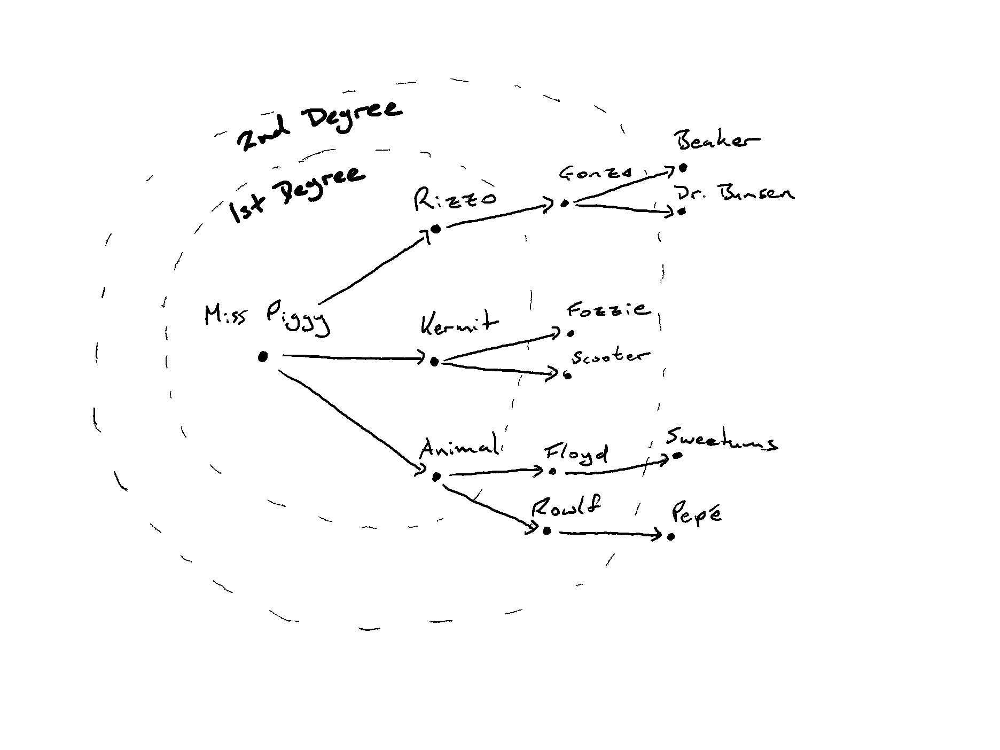

# Tracking

In this section we're going to explore and explain the current[0] implementation of tracking in
`radicle-link`. Tracking is the backbone of collaboration as it drives forward the exchange of
projects and their artifacts. So we're first going to build towards what it means "to track a peer".

A "peer" is a single device in the network. It has its own view of the network and tracks projects,
users, etc. in its own monorepo[1]. When one peer tracks another, it is tracking a particular
artifact in the network, but let's simplify our explanations here and talk about projects in
particular. When a peer tracks another it sets the intention to follow the other peer's progress
on this project. The metadata that describes the project, what branches the other peer is creating,
what commits they're making to which branches, and of course, the peer may want to see these changes
to merge them into their own branches.

## How Do We Track?

### Cloning

Tracking is best understood through the lens of the monorepo and how it changes while our peer
interacts with the network. Better yet, we are going to do away with generic names and have a fun
example (for my definition of fun). Our friend Kermit the Frog wants to start a Muppets Show project
and get all his friends involved. So he starts off by creating a project and his monorepo will look
like the following:

```
refs
`-- namespaces
    |-- $THE_MUPPET_SHOW
    |   `-- refs
    |       `-- heads # <-- code branches owned by $KERMITS_LAPTOP go here
    |           `-- muppet-mania
    |       `-- rad
    |           |-- id # <-- points to the identity document history
    |           |-- signed_refs # <-- signed refs of the peer
    |           |-- self # <-- points to the identity of $KERMIT_IDENTITY
    |           `-- ids
    |               `-- $KERMIT_IDENTITY
    `-- $KERMIT_IDENTITY
        `-- refs
            |-- heads
            |-- rad
                |-- id
                |-- signed_refs
                |-- self
                `-- ids
                    `-- $KERMIT_IDENTITY
```

In the above `$THE_MUPPET_SHOW` will be a hash value that acts as a stable identifier for the
project in the network. `$KERMITS_LAPTOP` refers to the unique peer identifier for Kermit's device. And
`$KERMIT_IDENTITY` refers to Kermit's identity document that has metadata such as his handle and
public keys[2].

Kermit, ever the romantic, decides to get his beloved Miss Piggy involved in the Muppet Show and
tells her the URN that identifies the project. She asks the network for the URN and Kermit's peer
responds with the project. So what would Miss Piggy's monorepo look like?

```
refs
`-- namespaces
    |-- $THE_MUPPET_SHOW
    |   `-- refs
    |       |-- heads # <-- code branches owned by $MISS_PIGGY go here, and are initially empty
    |       |-- rad
    |       |   |-- id
    |       |   |-- signed_refs
    |       |   |-- self # <-- points to the identity of $MISS_PIGGY
    |       |   `-- ids
    |       |       `-- $KERMIT_IDENTITY
    |       `-- remotes
    |           `-- $KERMITS_LAPTOP
    |               |-- heads
    |               |   `-- muppet-mania # <-- Kermit's main branch
    |               `-- rad
    |                   |-- id # <-- points to the identity of $KERMIT_IDENTITY
    |                   |-- signed_refs
    |                   |-- self
    |                   `-- ids
    |                       `-- $KERMIT_IDENTITY
    |-- $KERMIT_IDENTITY
    |   `-- refs
    |       |-- heads
    |       `-- rad
    |           |-- id
    |           |-- signed_refs
    |           |-- self
    |           `-- ids
    |               `-- $KERMIT_IDENTITY
    `-- $MISS_PIGGY_IDENTITY
        `-- refs
            |-- heads
            `-- rad
                |-- id
                |-- signed_refs
                |-- self
                `-- ids
                    `-- $MISS_PIGGY_IDENTITY
```

Again, `$MISS_PIGGY` and `$MISS_PIGGY_IDENTITY` are variables for Miss Piggy's peer identifier for
the device she's using and her identity document.

We note that there are some differences to Kermit's monorepo. The first thing to notice is that
there is an entry under `remotes` which is the view of `$KERMITS_LAPTOP`. We also notice that we
have replicated `$KERMIT_IDENTITY`.

As well as these changes, Miss Piggy's monorepo will also gain an entry in its `config` file:

```
[remote "$THE_MUPPET_SHOW/$KERMITS_LAPTOP"]
        url = rad-p2p://$MISS_PIGGY@$KERMITS_LAPTOP/$THE_MUPPET_SHOW.git?
        fetch = +refs/heads/*:refs/remotes/$KERMITS_LAPTOP/$THE_MUPPET_SHOW/*
```

<details>
<summary>Note on this fetch refspec</summary>

The fetch refspec[3] here will seem off to you when comparing it to the above layout of a single
monorepo, and you would be right. In this case Link only cares about the `url` and manages the fetch
refspecs under the hood. The URL allows us to manage who we are tracking and for what URN.
</details>

What we are learning from this exposition is that when we add a peer as someone we track when we clone
their project. Miss Piggy is adding Kermit as a `remote`, and so she is tracking his changes. If
Kermit announces changes and Miss Piggy's peer hears about these changes -- whether through Kermit's
device or some other peer -- she will apply them to update her view of Kermit's remote.

## The Tracking Exchange

In the above example some extra details were elided because we were only talking about two peers. So
when Miss Piggy cloned the repository from Kermit, it was almost obvious that he would end up in the
`remotes`. But what if we talked about more peers?

Let's say Gonzo ends up cloning from Miss Piggy. We can intuit from the above that Miss Piggy will
end up as a remote in Gonzo's monorepo view of the project. But not only that, Kermit will also be
added. Kermit's role is special since he's the maintainer of the project. In fact, when any peer
clones a project from the network all the maintainers will end up in that peer's remote list, and so
the maintainers are tracked. This makes sense since maintainers have the canonical view of the
project. They're ensuring the health and consistency of this piece of work.

The fun doesn't stop there. A portion of Miss Piggy's tracking graph will also be added to Gonzo's
graph. The idea here is that Gonzo isn't just relying on who he cloned from and the maintainers, but
also some portion of the network that is interested in the project. The natural question is, what
portion of the network that Miss Piggy is tracking is also tracked by Gonzo? The answer is 2 degrees
out.

In Rust the tracking graph is expressed as:
```rust
pub struct Remotes(HashMap<PeerId, HashMap<PeerId, HashSet<PeerId>>>);
```

So for a single `PeerId`, let's call it `p`, we have a sub-graph that consists of more `PeerId`s.
Picking one of those and call it `q`. Then `q` has a set of `PeerId`s. That is to say Miss Piggy has
a graph of 3 degress.

This is a bit of a mouthful, so let's view this pictorially:



So Gonzo inherits a portion of these remotes: the keys of the outer `HashMap` and the keys of the
inner `HashMap`.

<details>
<summary>
Before revealing what this would look like, try think about which peers Gonzo would track.
</summary>


</details>

### Directly Track

The other way a peer can track is by explicitly knowing a peer's identifier and telling their
monorepo that they are interested in this peer. For example, Miss Piggy also heard that Rizzo the
Rat is also taking part in the project and knows his peer identifier, $RIZZO. When she uses the
`track` function it creates a new entry in the monorepo config:

```
[remote "$THE_MUPPET_SHOW/$RIZZO"]
        url = rad-p2p://$MISS_PIGGY@$RIZZO/$THE_MUPPET_SHOW.git?
        fetch = +refs/heads/*:refs/remotes/$RIZZO/$THE_MUPPET_SHOW/*
```

The next time she hears from the network about changes from Rizzo she will fetch those changes and
apply them to her monorepo.

#### Main Contributions

This is particularly important if you would like to contribute back to a project. Miss Piggy has cloned
from Kermit, but it _does not_ mean that Kermit is tracking Miss Piggy reciprocally. So for Miss
Piggy's changes to be seen by a maintiner, Kermit in our case, she must be tracked by a maintainer,
or someone in their tracking graph.

### Untracking

There may come a point that a peer wants to untrack another peer. This could be down to a few
reasons, some examples being spam or inactivity. This is done by removing a remote from your
tracking graph and your monorepo.

## The Role of Seeds

As well as users in the network, another set of interesting actors in the network are "seeds". These
peers will tend to be indiscriminate about who they track. The idea is that a seed becomes a highly
connected node as well as being highly available. They will tend to have the latest and greatest
information about a project.

In our example, we can imagine that Kermit set up a seed node for the The Muppets Show project. Every
other peer will connect to the seed. So now if we go back to the begging of our story and see Miss
Piggy start up her peer, she will connect to the seed node. The node has already tracked The Muppets
Show project, so when she asks for the project it's likely she will get the project from the seed.

Later Kermit will announce that he has a new commit for the project. Since he's connected to the
seed, the seed will pick up the change and announce it the rest of its connected peers -- including
Miss Piggy.

[0] As of 8th Novemeber 2020
[1]: https://github.com/radicle-dev/radicle-link/blob/next/docs/rfc/identity_resolution.md
[2]: https://github.com/radicle-dev/radicle-link/blob/next/docs/spec/identities.md
[3]: https://git-scm.com/book/en/v2/Git-Internals-The-Refspec
